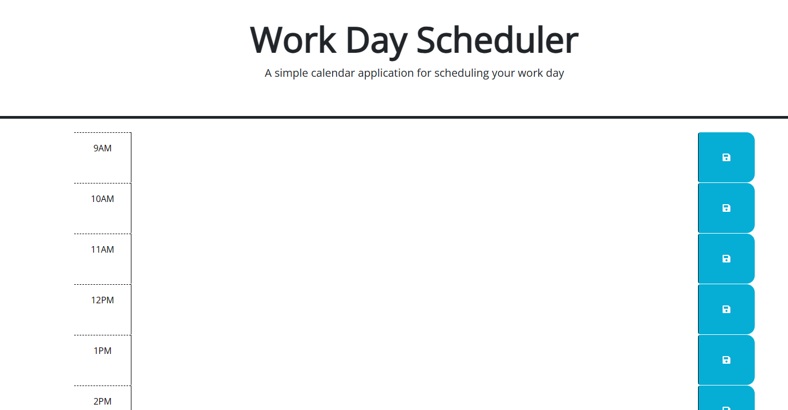

# Third-Party-API-Calendar-Application
## Work day scheduler that will save events for each hour of a typical working day (9am–5pm). This app will run in the browser and feature dynamically updated HTML and CSS powered by jQuery.

- My motivation for this project was to build an application that may be useful when I am out in the workforce.
- I built this project to practice using third party APIs. 
- This challenge will help me better understand how JavaScript is a critical component of building an application.
- I learned that anything is possible with JavaScript. 

## Screenshot
 